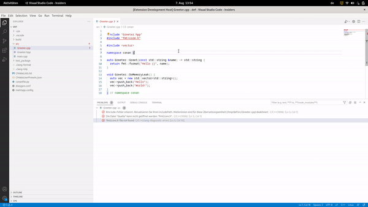
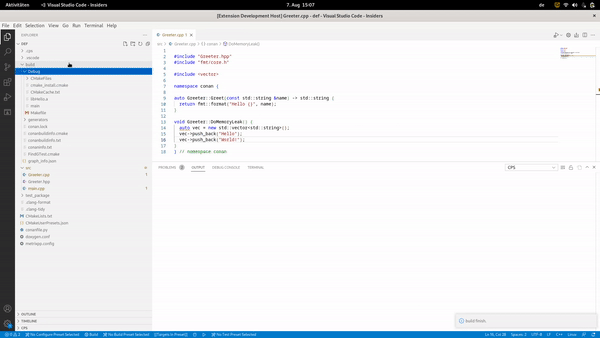
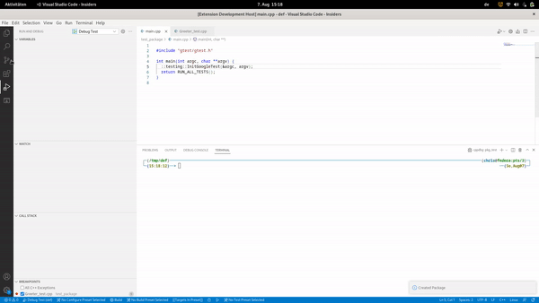

A Personal extension for C++ projects.

(currently still under heavy development and just tested with linux)

Handle C++ projects are always difficult (since C++ is powerful and with too many options) ...

In order to setup C++ projects fast and in order to easily get : 

- packages dependency graph
- targets dependency graph
- preview of doxygen documentation
- cppchecks 
- style guide checks
- guide lines checks
- project templates 
- much more ... 

I transformed my "cheat sheet and knowledge" into an VS Code extension.

This extension shall combine : 

- conan for packages
- cmake for build 
- cppcheck for static code checks before build
- doxygen for documentation (including execution flow)
- metrix with Metrix++

The default way is : 

1) generate new project 
- commands : "CPS - Import default template" + "CPS - New Project"
- look : 

2) import packages (including header files)
- command : "CPS - Import depending packages" 
- look : 

3) install packages and build (cppcheck to detect errors before)
- commands : "CPS - Install Packages" + "CPS - Build project"
- look : 

4) create package and test (choose Debug build type for "walking" through your tests)
- command : "CPS -  Create Package and Test"
- look : 

P.S. Until I have a proper logo - i use the Iso C++ Logo
